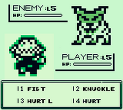

# Yaguarete (Gameboy Version)

 Created with GB-Studio by chrismaltby.

▶︎ [itchio](https://g0rd5.itch.io/yaguarete)

A -short- rpg based on the myths and legends of the Guarani people from South America, heavily influenced by Dragon Quest and Pokemon.

This was made using GB Studio by Chris Maltby, assets from Iroiroem, Pixel Pete, Mushio, Rekimaru and the Battle System Script from ManuGamesDev.

## Contributing
This project is licensed under the MIT License.
